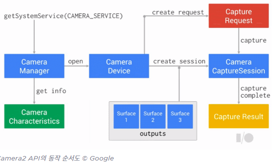
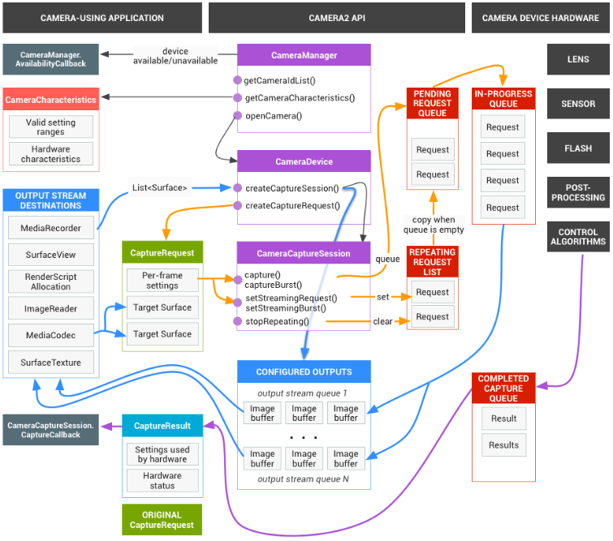

# Camera2 API

> * 3개 이상의 카메라를 쓸수 있다
>   * (pie 9.0)이상에서는 여러 카메라를 동시에 쓸 수있음
> * 수동 컨트롤 지원
>   * 초점 거리를 정하거나 노출 시간, ISO등을 API에서 직접 설정 해줄 수 있음
> * 연속 촬영, RAW지원 추가

* Camera2 API 순서도
  * CameraManager 
    * 시스템 서비스로, 사용 가능한 카메라와 카메라 기능을 쿼리할 수 있고 카메라를 열수 있다
  * CameraCharacteristics
    * 카메라의속성을 담고 있는 객체
    * 속성을 가져오는 것만 가능
    * 속성을 정하는건 다른 방식으로 처리를 해줘야한다
  * CameraDevice
    * 카메라 객체
  * CaptureRequest
    * 사진 촬영이나 카메라 미리보기를 요청하는데 쓰이는 객체
    * 카메라의 설정을 병경할 때도 관여한다.
  * CameraCaptureSession
    * CaptureRequest를 보내고 카메라하드웨어에서 결과를 받는 세션
  * CaptureResult
    * CaptureRequest의 결과
    * 이미지의 메타데이터도 가져 올수 있다.
* WorkFlow

 

# Reference

[Basic Code](https://github.com/googlearchive/android-Camera2Basic)

[AndroidDevelopers](https://developer.android.com/jetpack/androidx/releases/camera)

[AndroidDevelopers 개요](https://developer.android.com/training/camerax)

[camera2 API Blog](https://blog.shift.moe/2018/09/05/camera2-overview/)

[asdf](https://pluu.github.io/blog/android/droidkaigi/2016/06/11/droidkaigi-2016-first-step-camera2-apis/)

[Camera API LifeCycle](https://cnwlcjf.tistory.com/86)

