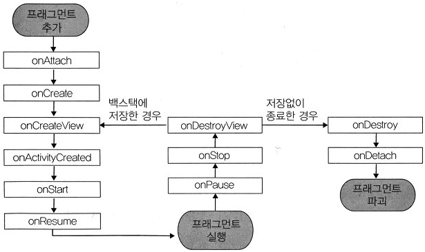

# Fragment

> 하나의 화면을 나누어 보여주거나 각각의 부분화면 단위로 바꾸어 보여주고 싶을때 사용

* 액티비티를 분할하여 화면의 한 부분을 정의한다.
* 액티비티와 같이 레이아웃, 동작 처리, 생명주기를 가지는 독립적인 모듈이다.
* 다른 액티비티에서도 사용 할 수 있어 재사용성이 뛰어나다.
* 액티비티 내에서 실행 중에 추가, 제거가 가능하다.


## Fragment 생명주기

* 반드시 하나의 액티비티 안에 소속 되어야 한다
* 독립적인 생명 주기를 가진다



> 1. 프래그먼트 추가 - Activity 에 프레그먼트가 부착되고 초기화
> 2. 프래그먼트 실행 - 정해진 동작을 수행
> 3. 프래그먼트 파괴 - 역할을 다하고 종료

## 쥐의 사항

* clickable = true 로 설정해주지 않으면 Fragment Layout 뒤에 쌓여있는 화면에 click 이벤트가 눌리게된다.

```xml
<LinearLayout xmlns:android="http://schemas.android.com/apk/res/android"
    android:orientation="vertical"
    android:layout_width="match_parent"
    android:layout_height="match_parent"
    android:background="#00eeff"
    android:clickable="true">  //해당 
```


[Fragment 참고](https://tedrepository.tistory.com/5)